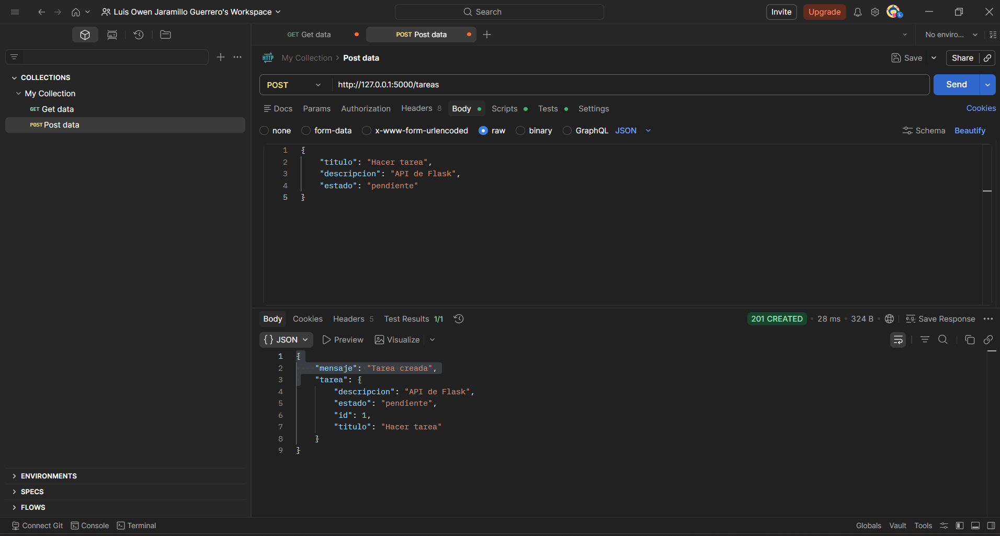
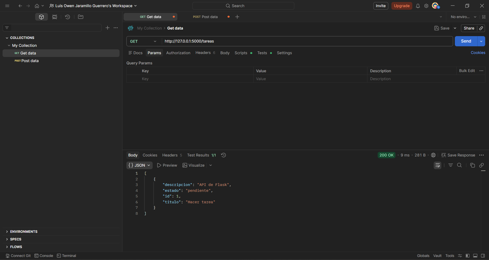
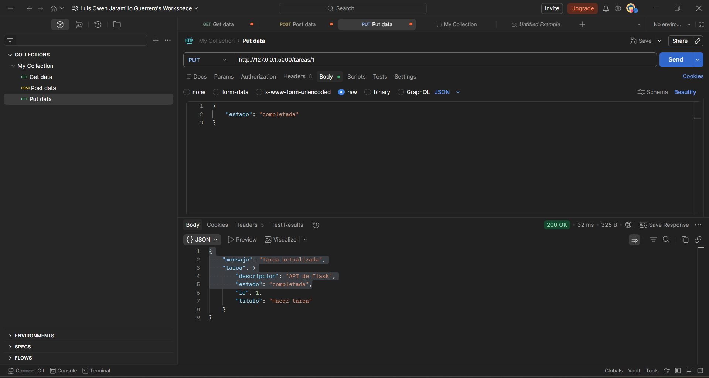
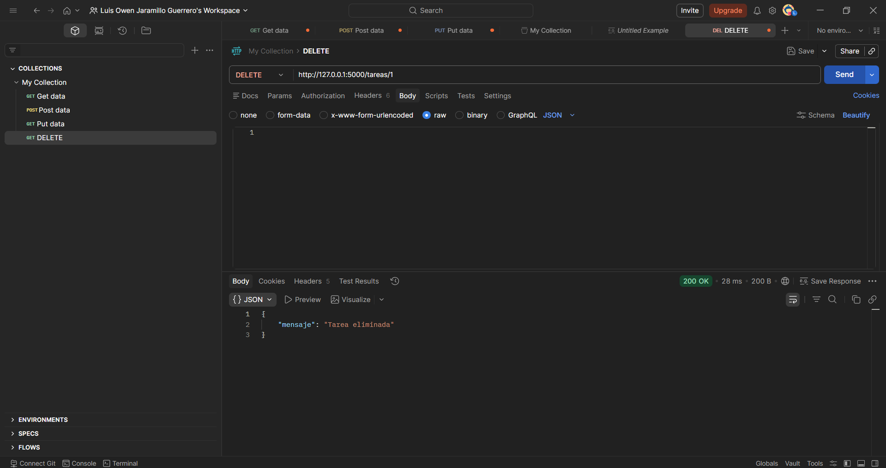

# API de Gestión de Tareas

Este proyecto consiste en una API REST desarrollada en **Flask** que permite administrar tareas personales mediante operaciones CRUD (Crear, Leer, Actualizar y Eliminar).

---

Cada tarea incluye los siguientes atributos:
- `titulo`
- `descripcion`
- `estado`
---

## Tecnologías utilizadas

- Python 3
- Flask
- Flask-SQLAlchemy
- SQLite (base de datos)

---

## Instalación y ejecución

1. Clonar el repositorio:
```bash id="x1v9hj"
git clone <URL_DEL_REPOSITORIO>
cd flask_tareas_api
```

2.Crear y activar un entorno virtual (Windows PowerShell):
```bash id="x1v9hj"
python -m venv venv
.\venv\Scripts\Activate.ps1
```

3.Instalar dependencias:
```bash id="x1v9hj"
pip install Flask Flask-SQLAlchemy
```

4. Ejecutar la API:
```bash id="x1v9hj"
python app.py
```
La API quedará disponible en: http://127.0.0.1:5000/

---

## Endpoints

1. Crear tarea (POST)

URL: /tareas

Método: POST

Body (JSON):

```bash id="x1v9hj"
{
    "titulo": "Hacer tarea",
    "descripcion": "API CRUD con Flask",
    "estado": "pendiente"
}
```

Respuesta exitosa:
```bash id="x1v9hj"
{
    "mensaje": "Tarea creada",
    "tarea": {
        "id": 1,
        "titulo": "Hacer tarea",
        "descripcion": "API CRUD con Flask",
        "estado": "pendiente"
    }
}
```


----

2. Consultar todos los estudiantes (GET)

URL: /tareas

Método: GET

Respuesta:

```bash id="x1v9hj"
[
    {
        "id": 1,
        "titulo": "Hacer tarea",
        "descripcion": "API CRUD con Flask",
        "estado": "pendiente"
    }
]
```



----

3. Actualizar tarea (PUT)

URL: /tareas/1

Método: Put

Body:

```bash id="x1v9hj"
{
    "estado": "completada"
}
```
Respuesta;
```bash id="x1v9hj"

{
    "mensaje": "Tarea actualizada",
    "tarea": {
        "id": 1,
        "titulo": "Hacer tarea",
        "descripcion": "API CRUD con Flask",
        "estado": "completada"
    }
}
```


---

4. Eliminar tarea (DELETE)

URL: /tareas/1

Método: Delete

Respuesta:

```bash id="x1v9hj"
{
    "mensaje": "Tarea eliminada"
}
```



---

## Evidencia de pruebas

Se realizaron pruebas utilizando Postman, verificando:

  -Creación de tareas (POST)
  
  -Consulta de tareas (GET)
  
  -Actualización de tareas (PUT)
  
  -Eliminación de tareas (DELETE)
Cada operación fue validada mostrando la respuesta correcta del servidor.

---

## Autor

Nombre: Luis Owen Jaramillo Guerrero

Práctica API REST CRUD con Flask


